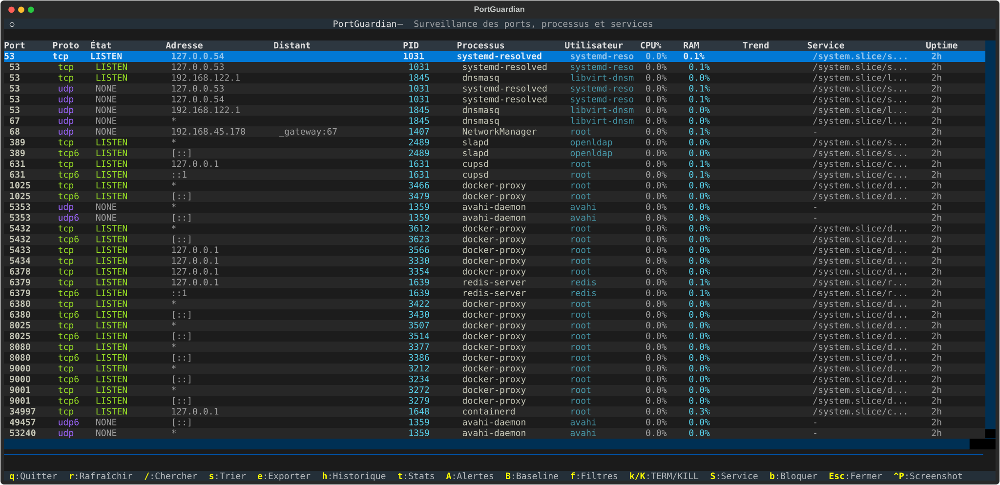
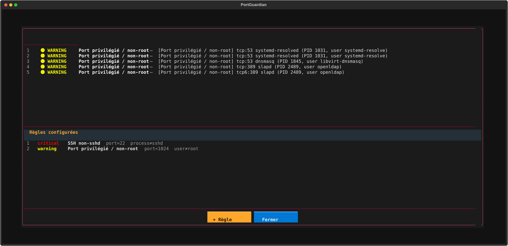
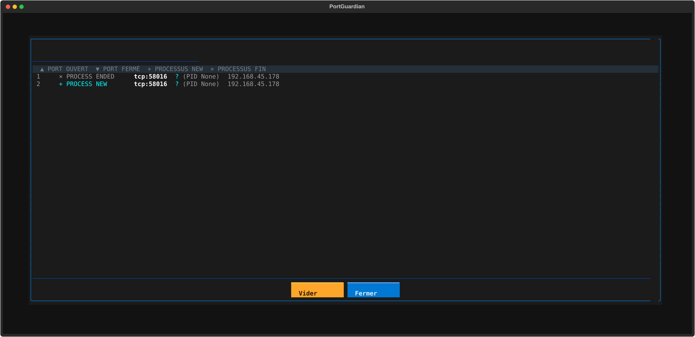
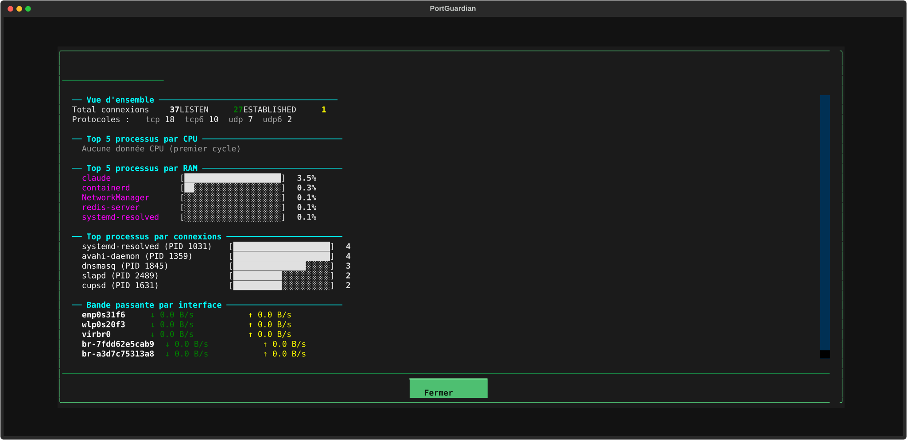

# PortGuardian

**Surveillance des ports reseau, processus et services systemd en temps reel — local et multi-machines.**

PortGuardian est un outil de securite reseau pour Linux qui surveille les ports ouverts, identifie les programmes qui utilisent le reseau, bloque des ports ou des adresses IP, et permet de terminer des processus suspects — le tout depuis une interface unique.

Trois modes d'utilisation :
- **TUI interactif** — interface terminal temps reel
- **Agent daemon** — surveillance autonome avec notifications
- **Serveur web** — dashboard centralise multi-machines

Construit avec Python 3.12+, Textual, psutil et Flask.

---

## Table des matieres

- [Installation](#installation)
- [Utilisation](#utilisation)
- [Fonctionnalites](#fonctionnalites)
  - [Surveillance des ports ouverts/fermes](#surveillance-des-ports-ouvertsfermes)
  - [Programmes utilisant le reseau](#programmes-utilisant-le-reseau)
  - [Blocage de ports et d'adresses IP](#blocage-de-ports-et-dadresses-ip)
  - [Terminer ou suspendre des processus](#terminer-ou-suspendre-des-processus)
  - [Alertes et regles de securite](#alertes-et-regles-de-securite)
  - [Baseline de securite](#baseline-de-securite)
  - [Historique des evenements](#historique-des-evenements)
  - [Statistiques systeme](#statistiques-systeme)
  - [Recherche, tri et filtres](#recherche-tri-et-filtres)
  - [Export des donnees](#export-des-donnees)
  - [Integration systemd](#integration-systemd)
  - [Dashboard web multi-machines](#dashboard-web-multi-machines)
- [Raccourcis clavier](#raccourcis-clavier)
- [Architecture](#architecture)
- [Tests](#tests)
- [FAQ](#faq)
- [Changelog](#changelog)
- [Licence](#licence)

---

## Installation

### Prerequis

- **Python 3.12** ou superieur
- **Linux** (Ubuntu 24.04+ recommande)
- **systemd** (pour la gestion des services)

### Installation rapide

```bash
git clone <url-du-depot>
cd port_listen_script
python3 -m venv venv
venv/bin/pip install -r portguardian/requirements.txt
```

### Dependances

| Paquet   | Version minimale | Role                          |
|----------|-----------------|-------------------------------|
| textual  | 0.75.0          | Interface TUI                 |
| rich     | 13.7.0          | Formatage et rendu terminal   |
| psutil   | 5.9.0           | Introspection systeme         |
| flask    | 3.0.0           | Serveur web / dashboard       |

---

## Utilisation

PortGuardian se lance via un script unique `./portguardian` :

```bash
cd portguardian/

# TUI interactif (necessite sudo)
./portguardian

# Scan unique des ports
./portguardian scan --listen

# Scan avec export JSON
./portguardian scan --format json --output /tmp/ports.json

# Lancer le serveur web
./portguardian server --port 8600

# Lancer l'agent daemon
./portguardian agent run --server http://monitor:8600

# Aide complete
./portguardian help
```

### Commandes disponibles

| Commande | Description |
|----------|-------------|
| `./portguardian` | Lance le TUI interactif (mode par defaut) |
| `./portguardian tui` | Idem |
| `./portguardian server [options]` | Lance le dashboard web |
| `./portguardian agent <run\|once\|init>` | Lance l'agent daemon |
| `./portguardian scan [options]` | Scan unique (CLI) |
| `./portguardian help` | Affiche l'aide |

### Deploiement multi-machines

```bash
# Sur le serveur central :
./portguardian server --port 8600 --api-key SECRET

# Sur chaque machine a surveiller :
./portguardian agent run --server http://serveur:8600 --api-key SECRET

# Installer en service systemd (optionnel) :
sudo cp daemon/portguardian-agent.service /etc/systemd/system/
sudo systemctl enable --now portguardian-agent
```

---

## Fonctionnalites

### Surveillance des ports ouverts/fermes

Affiche en temps reel tous les ports TCP et UDP ouverts sur le systeme, avec les etats de connexion (LISTEN, ESTABLISHED, TIME_WAIT, CLOSE_WAIT, SYN_SENT, etc.), le support IPv4/IPv6, et la detection automatique des changements (nouveau port ouvert, port ferme).



- Rafraichissement automatique configurable (defaut : 2 secondes)
- Protocoles : TCP, UDP, sockets Unix
- Deduplication intelligente des connexions
- Resolution DNS inverse asynchrone avec cache TTL 5 min
- Colonne Trend : sparkline ASCII de l'historique CPU par processus

---

### Programmes utilisant le reseau

Identifie quel processus possede chaque connexion : PID, nom du programme, utilisateur, CPU%, memoire, uptime, et adresses IP source/destination.


- Association processus ↔ connexion via psutil (necessite root)
- Affichage des adresses locales et distantes avec port
- Details complets d'un processus en selectionnant une ligne (PID, PPID, threads, ligne de commande, fichiers ouverts, variables d'environnement)
- Bande passante par interface reseau (stats globales)

---

### Blocage de ports et d'adresses IP

Bloque ou debloque des ports et des adresses IP directement depuis l'interface, avec detection automatique du backend firewall.

- **Ports** (`b`) : blocage simple (`80`), liste (`80,443`), plage (`8000-8100`)
- **IP** (`i`) : blocage d'adresses IPv4, IPv6, CIDR (`192.168.1.0/24`, `10.0.0.1,172.16.0.1`)
- Protocoles : TCP, UDP, ou les deux
- Direction : entrant, sortant, ou les deux
- 4 backends : ufw > firewalld > nftables > iptables (detection automatique)
- Persistance automatique des regles

---

### Terminer ou suspendre des processus

Envoie des signaux aux processus directement depuis le tableau, avec confirmation obligatoire.

| Touche | Signal | Effet |
|--------|--------|-------|
| `k` | SIGTERM | Arret propre du processus |
| `K` | SIGKILL | Arret force immediat |
| `p` | SIGSTOP | Suspension (pause) |
| `c` | SIGCONT | Reprise du processus suspendu |

- Dialogue de confirmation avant chaque action
- Gestion des erreurs (processus deja mort, permission refusee)
- Rafraichissement automatique apres le signal

---

### Alertes et regles de securite

Systeme de regles d'alerte configurables pour detecter les situations suspectes.



- Creation de regles avec conditions : port exact/range, protocole, processus, utilisateur
- Exclusions : `process_not`, `user_not`
- Severites : `critical`, `warning`, `info`
- Regles par defaut : SSH ecoute par un processus non-sshd, port < 1024 par un non-root
- Notification automatique lors d'alertes critiques
- Persistees dans `~/.config/portguardian/rules.json`

---

### Baseline de securite

Capture un instantane de l'etat reseau pour detecter toute deviation ulterieure.

- Premier appui sur `B` : sauvegarde de la baseline dans `~/.local/share/portguardian/baseline.json`
- Appuis suivants : affiche le nombre de connexions nouvelles/disparues
- Les connexions absentes de la baseline sont surlignees en vert dans le tableau

---

### Historique des evenements

Journal scrollable de tous les changements reseau detectes automatiquement.



- Types : port ouvert, port ferme, nouveau processus, processus termine
- Affichage : timestamp, type, protocole, port, processus
- Buffer circulaire de 500 entrees
- Bouton "Vider" pour reinitialiser

---

### Statistiques systeme

Vue d'ensemble des ressources et de la bande passante.



- Top 5 processus par CPU% avec barres de progression
- Top 5 processus par RAM%
- Top processus par nombre de connexions
- Bande passante temps reel par interface (envoye/recu)

---

### Recherche, tri et filtres

- Recherche (`/`) insensible a la casse sur tous les champs
- Tri (`s`) par toutes les colonnes avec sens ascendant/descendant
- **Filtres nommes et persistes** (`f`) dans `~/.config/portguardian/filters.json`

---

### Export des donnees

Export des connexions en plusieurs formats depuis le TUI (`e`) ou en CLI.

- Formats : CSV, JSON, TXT (texte tabule)
- Champs : protocol, local_addr, local_port, remote_addr, remote_port, status, pid, process_name, username, cpu_percent, memory_percent, service, uptime
- Fichiers horodates dans le repertoire `exports/`
- Screenshots SVG de l'interface (`Ctrl+P`) dans `screenshots/`

---

### Integration systemd

Gestion des services systemd associes aux processus directement depuis l'interface (`S`).

- Detection automatique du service associe a un processus
- Actions : start, stop, restart, reload, status
- Consultation des logs (journalctl) dans un ecran dedie scrollable

---

### Dashboard web multi-machines

Serveur web centralise qui recoit les rapports des agents et expose un dashboard temps reel.

- Vue d'ensemble : nombre de machines, connexions totales, ports en ecoute, evenements
- Detail par machine : ports en ecoute, connexions, evenements, bande passante
- Page evenements dediee avec filtrage
- Auto-refresh toutes les 15 secondes
- Theme dark
- Section "Deployer un agent" avec commandes copiables
- API REST pour integration

#### API REST

| Endpoint | Methode | Description |
|----------|---------|-------------|
| `/api/report` | POST | Reception des snapshots agents |
| `/api/hosts` | GET | Liste des machines |
| `/api/hosts/<hostname>` | GET | Detail d'une machine |
| `/api/hosts/<hostname>/history` | GET | Historique d'une machine |
| `/api/events` | GET | Evenements globaux recents |

---

## Raccourcis clavier

| Touche | Action |
|--------|--------|
| `q` | Quitter |
| `r` | Rafraichir manuellement |
| `/` | Rechercher |
| `s` | Trier par colonne |
| `e` | Exporter (CSV/JSON/TXT) |
| `Escape` | Effacer le filtre / fermer |
| `Ctrl+P` | Screenshot SVG |
| `A` | Alertes et regles |
| `B` | Baseline |
| `b` | Bloquer/debloquer des ports |
| `i` | Bloquer/debloquer des IPs |
| `h` | Historique des evenements |
| `t` | Statistiques |
| `f` | Filtres sauvegardes |
| `k` | SIGTERM |
| `K` | SIGKILL |
| `p` | Suspendre (SIGSTOP) |
| `c` | Reprendre (SIGCONT) |
| `S` | Menu service systemd |

---

## Architecture

```
portguardian/
├── portguardian                # Script d'entree unique (bash)
├── main.py                     # Point d'entree Python (TUI + CLI)
├── app.py                      # Application Textual (bindings, workers)
├── config.py                   # Configuration centralisee
├── core/                       # Logique metier
│   ├── ports.py                # Collecte des connexions reseau
│   ├── process.py              # Informations processus (psutil)
│   ├── services.py             # Detection et gestion systemd
│   ├── search.py               # Moteur de recherche et tri
│   ├── exporter.py             # Export (CSV, JSON, TXT)
│   ├── watcher.py              # Detection des changements reseau
│   ├── firewall.py             # Blocage ports + IP (ufw/firewalld/nft/iptables)
│   ├── alerts.py               # Moteur de regles d'alerte
│   ├── baseline.py             # Snapshot et detection de deviations
│   ├── dns_cache.py            # Resolution DNS inverse async + cache
│   ├── bandwidth.py            # Bande passante par interface
│   ├── sparkline.py            # Sparklines ASCII
│   ├── filters.py              # Filtres de recherche persistes
│   ├── permissions.py          # Verification des privileges root
│   └── logs.py                 # Logging applicatif
├── daemon/                     # Agent autonome
│   ├── agent.py                # Collecte periodique + detection
│   ├── config.py               # Configuration daemon
│   ├── notifier.py             # Notifications (Slack, email, webhook)
│   └── cli.py                  # CLI du daemon
├── server/                     # Serveur web
│   ├── app.py                  # API Flask + dashboard
│   ├── cli.py                  # CLI du serveur
│   ├── templates/              # Templates HTML (dashboard, host, events)
│   └── static/style.css        # Theme dark
├── ui/                         # Composants TUI
│   ├── dashboard.py            # Layout principal
│   ├── tables.py               # Tableau interactif
│   ├── details.py              # Panneau de details processus
│   ├── dialogs.py              # Dialogues modaux (recherche, tri, export, firewall, IP)
│   ├── history_screen.py       # Ecran historique
│   ├── stats_screen.py         # Ecran statistiques
│   ├── alerts_screen.py        # Ecran alertes
│   ├── header.py               # En-tete systeme
│   └── footer.py               # Pied de page raccourcis
├── utils/                      # Utilitaires (formatage, couleurs, icones)
├── tests/                      # 289 tests unitaires
├── exports/                    # Fichiers exportes
├── screenshots/                # Screenshots SVG
└── logs/                       # Logs applicatifs
```

### Configuration utilisateur (XDG)

| Fichier | Contenu |
|---------|---------|
| `~/.config/portguardian/rules.json` | Regles d'alerte |
| `~/.config/portguardian/filters.json` | Filtres de recherche |
| `~/.config/portguardian/daemon.json` | Configuration agent |
| `~/.local/share/portguardian/baseline.json` | Snapshot baseline |
| `~/.local/share/portguardian/daemon/latest.json` | Dernier snapshot agent |

---

## Tests

```bash
./portguardian scan --listen  # test rapide
../venv/bin/python3 -m pytest tests/ -v  # suite complete (289 tests)
```

---

## FAQ

**Pourquoi certains processus affichent un PID vide ?**
Sans `sudo`, le systeme ne permet pas de voir les processus d'autres utilisateurs.

**Quel backend firewall est utilise ?**
Detection automatique : ufw > firewalld > nftables > iptables.

**Comment ajouter PortGuardian au PATH ?**

```bash
sudo ln -s /chemin/vers/portguardian/portguardian /usr/local/bin/portguardian
```

---

## Changelog

### v0.3

- **Blocage d'adresses IP** — nouvelle fonctionnalite : blocage/deblocage d'IPs (IPv4, IPv6, CIDR) via touche `i`, support des 4 backends firewall
- **Script unifie `./portguardian`** — remplace les multiples commandes `python3 -m ...` par un point d'entree unique (tui, server, agent, scan, help)
- **Corrections firewall** — fix iptables `--dport` sur OUTPUT, fix syntaxe rich rule firewalld, fix match exact nftables, fix deblocage bidirectionnel ufw
- **Persistance nftables** — les regles sont sauvegardees dans `/etc/nftables.d/portguardian.nft` pour survivre au reboot
- **Fix watcher** — suppression du raccourci par comptage qui masquait les changements simultanes (port ouvert + port ferme en meme temps)
- **Page evenements web** — nouveau template HTML `/events` (la navigation ne renvoie plus de JSON)
- **Section deploiement** — instructions de deploiement d'agent avec commandes copiables dans le dashboard
- **Sidebar nettoyee** — suppression des liens API bruts de la navigation
- **README refait** — table des matieres, screenshots par fonctionnalite, commandes unifiees

### v0.2

- **Mode daemon** — agent autonome qui tourne en arriere-plan, detecte les changements de ports, et notifie via Slack, email ou webhook
- **Serveur web** — dashboard Flask centralise pour surveiller N machines depuis un navigateur
- **API REST** — endpoints pour recevoir les snapshots agents, lister les machines, consulter l'historique
- **Multi-machines** — architecture agent/serveur pour deploiement sur plusieurs machines
- **Notifications** — support Slack webhook, email, webhook generique
- **Service systemd** — fichiers `.service` pour agent et serveur
- **Configuration daemon** — fichier JSON (`~/.config/portguardian/daemon.json`) pour parametrer l'agent

### v0.1

- **TUI interactif** — interface terminal temps reel type htop avec Textual
- **Surveillance des ports** — collecte TCP/UDP, IPv4/IPv6, tous etats de connexion
- **Detection des changements** — watcher avec historique circulaire (500 entrees)
- **Gestion des processus** — SIGTERM, SIGKILL, SIGSTOP, SIGCONT avec confirmation
- **Blocage de ports** — support ufw, firewalld, nftables, iptables
- **Alertes configurables** — regles avec conditions, severites, persistance JSON
- **Baseline de securite** — snapshot + detection de deviations
- **Statistiques** — top CPU/RAM, bande passante par interface
- **Recherche et tri** — recherche multi-champs, tri par colonne, filtres persistes
- **Export** — CSV, JSON, TXT avec metriques (cpu, ram, service, uptime)
- **Integration systemd** — start/stop/restart/logs des services associes
- **Resolution DNS** — reverse DNS asynchrone avec cache TTL
- **Sparklines** — historique CPU par processus en caracteres ASCII
- **Screenshots** — export SVG de l'interface (`Ctrl+P`)

---

## Licence

MIT License — Copyright (c) 2024 PortGuardian Team
